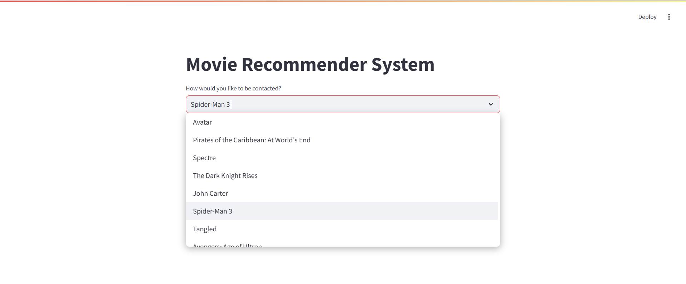
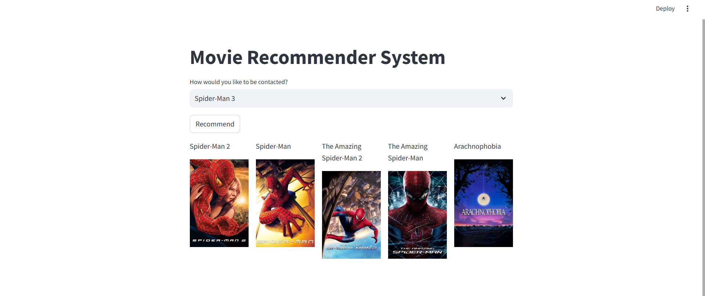

# Movie Recommender System

## Project Description

This Movie Recommender System suggests 5 movies to the user based on their preferences. The user inputs their preferences, and the system recommends movies accordingly.

The project involves data preprocessing, stemming using the Porter Stemmer, and vectorization with Count Vectorizer to create a recommendation model.

## Technologies Used
- **Streamlit** for frontend development
- **Python** for data processing and machine learning
- **Natural Language Processing** (NLP) techniques such as stemming and vectorization

## Preprocessing Details
The preprocessing steps, including cleaning the data, stemming with Porter Stemmer, and vectorization using Count Vectorizer, are handled in the `movie-recommender-system.ipynb` file.

## How to Use
1. Run the Streamlit app: `streamlit run app.py`
2. Enter your movie preferences.
3. The system will recommend 5 movies based on your input.

## Screenshots
### Output Example 1

### Output Example 2

## Installation
1. Clone the repository: `git clone https://github.com/yourusername/movie-recommender-system.git`
2. Install dependencies: `pip install -r requirements.txt`

